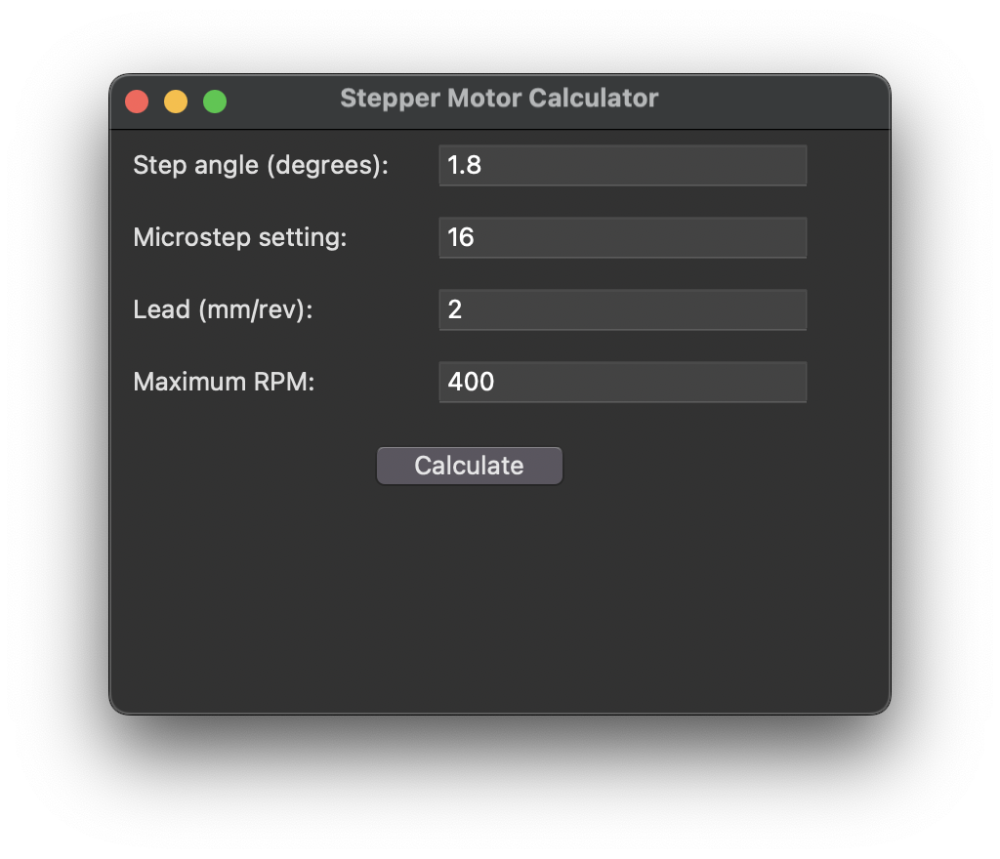

# Stepper Motor Calculator

## Overview

Welcome to the **Stepper Motor Calculator**! This is a desktop application designed for engineers and hobbyists working with stepper motors, particularly for applications such as PCB drilling and milling machines. The application calculates key parameters such as full steps per revolution, microsteps per revolution, steps per millimeter, and maximum linear speed based on user inputs.



## Features

- **User-Friendly Interface**: Easy-to-use graphical interface built with Tkinter.
- **Input Fields**: Provides input fields for step angle, microstep setting, pitch, and maximum RPM.
- **Instant Calculation**: Calculates and displays results instantly upon button click.
- **Custom Error Handling**: Displays custom error messages for invalid inputs.

## Installation

1. **Clone the repository**:
    ```sh
   git clone https://github.com/D7x00/StepperMotorCalculator.git
    ```
2. **Navigate to the project directory**:
    ```sh
    cd stepper-motor-calculator
    ```
3. **Install the required dependencies**:
    ```sh
    pip install -r requirements.txt
    ```

## Usage

1. **Run the application**:
    ```sh
    python main.py
    ```
2. **Input the required parameters**:
    - **Step angle (degrees)**: The step angle of your stepper motor.
    - **Microstep setting**: The microstepping setting of your stepper driver.
    - **Pitch (mm)**: The pitch of the lead screw or belt.
    - **Maximum RPM**: The maximum revolutions per minute of your motor.

3. **Click "Calculate"** to view the results.

## Example

### Input
- **Step angle**: 1.8
- **Microstep setting**: 16
- **Pitch**: 2
- **Maximum RPM**: 1000

### Output
```
Full steps per revolution: 200.00
Microsteps per revolution: 3200.00
Steps per millimeter: 400.00
Maximum linear speed: 8000.00 mm/min
```

## Code Explanation

### Main Application Class
```python
class StepperMotorCalculator(tk.Tk):
    def __init__(self):
        super().__init__()
        self.title("Stepper Motor Calculator")
        self.geometry("400x300")
        self.resizable(False, False)
        self.create_widgets()
```
- Initializes the main application window with a title and fixed size.

### Widget Creation
```python
def create_widgets(self):
    self.create_label_entry("Step angle (degrees):", "step_angle")
    self.create_label_entry("Microstep setting:", "microstep_setting")
    self.create_label_entry("Pitch (mm):", "pitch")
    self.create_label_entry("Maximum RPM:", "max_rpm")

    calc_button = ttk.Button(self, text="Calculate", command=self.calculate)
    calc_button.grid(row=4, column=0, columnspan=2, pady=10)
    
    title_font = ("Helvetica", 18, "bold")
    label4 = ttk.Label(self, text="PCB Drilling And Milling Machine", font=title_font)
    label4.grid(row=5, column=0, columnspan=2, pady=10)
```
- Creates input fields and labels for the required parameters.
- Adds a calculate button that triggers the calculation process.

### Calculation Logic
```python
def calculate(self):
    try:
        step_angle = float(self.step_angle_entry.get())
        microstep_setting = int(self.microstep_setting_entry.get())
        lead = float(self.pitch_entry.get()) * 4
        max_rpm = float(self.max_rpm_entry.get())

        full_steps_per_revolution = 360 / step_angle
        microsteps_per_revolution = full_steps_per_revolution * microstep_setting
        steps_per_millimeter = microsteps_per_revolution / lead
        max_linear_speed = lead * max_rpm

        result = (
            f"Full steps per revolution: {full_steps_per_revolution:.2f}\n"
            f"Microsteps per revolution: {microsteps_per_revolution:.2f}\n"
            f"Steps per millimeter: {steps_per_millimeter:.2f}\n"
            f"Maximum linear speed: {max_linear_speed:.2f} mm/min"
        )
        showinfo("Calculation Results", result)
    except ValueError as e:
        self.show_custom_error("Input Error", f"Invalid input: {e}")
```
- Performs calculations based on the input values and displays the results in a message box.
- Handles input errors by displaying a custom error dialog.

### Error Handling
```python
def show_custom_error(self, title, message):
    error_dialog = Toplevel(self)
    error_dialog.title(title)
    error_dialog.geometry("500x100")
    error_dialog.resizable(False, False)

    custom_icon = tk.PhotoImage(file="error.png")
    icon_label = Label(error_dialog, image=custom_icon)
    icon_label.image = custom_icon
    icon_label.pack(side="left", padx=10, pady=10)

    message_label = Label(error_dialog, text=message)
    message_label.pack(side="left", padx=10, pady=10)

    ok_button = Button(error_dialog, text="OK", command=error_dialog.destroy)
    ok_button.pack(side="bottom", pady=10)
```
- Displays a custom error dialog with a message and an OK button.


## Acknowledgements

- Tkinter library for providing the GUI components.
- The open-source community for continuous support and improvements.


## Contact

For any inquiries, please contact [kareemahmedmohamed370@gmail.com](https://mail.google.com/mail).

---

Thank you for using Stepper Motor Calculator! Happy calculating!
